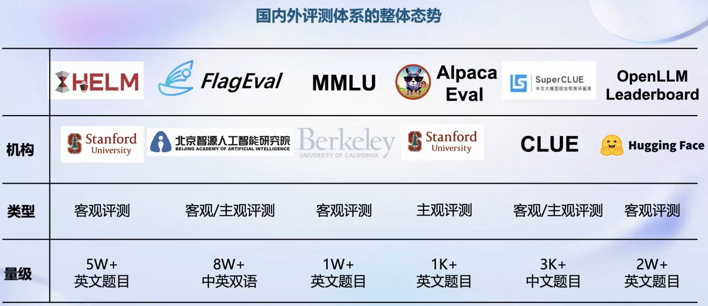

# 1书生-浦语大模型全链路开源体系

课程资料

学习手册  <https://drnj22rqza.feishu.cn/docx/XIWJdxU7xoM9y0xhabGc3s1tnDg?>

本次课程视频 <https://www.bilibili.com/video/BV1Rc411b7ns/>

## 大模型简介

## 书生-浦语InternLM大模型

### 相关资料

*   InternLM-techreport <https://github.com/InternLM/InternLM-techreport/blob/main/InternLM.pdf>

*   Porject <https://internlm.org/>

*   code <https://github.com/InternLM/InternLM>

    *   <https://internlm.readthedocs.io/zh-cn/latest/install.html#id2>

### InternLM-7B

8K语境窗口

定位社区低成本可用最佳模型规模

### InternLM-20B

4K训练语境长度，推理时可外推16K

定位商业场景开发定制高精度

较小模型规模

### InternLM-123B

通用大预言模型能力全面覆盖

千亿模型规模

## 大模型应用

### 模型应用流程

### 书生-浦语全链路开源开放体系

## 全链条开放体系

### 数据

#### 书生万卷1.0

#### OpenDataLab

### 预训练

高可扩展，支持8卡到千卡训练，千卡加速效率达92%

Hybird Zero技术加速50%

兼容HuggingFace

支持多种规格语言模型，开箱即用

## 微调

### 场景

#### 增量续训

学习新知识，比如垂直领域知识。数据以文章、书籍为主

#### 有监督微调

学习和遵循指令，或者注入少量领域知识。数据以高质量对话、问大数据

### 方式

#### 全量参数微调

#### 部分参数微调

### XTunner

## 评测

HELM 5W+英文题目

MMLU 考试类的评分集

### OpenCompass

#### 多学科分类支持

#### 平台架构

亮点

支持多种模型

支持分布式评测

提供便捷数据集接口，可自定义数据集

敏捷迭代

## 部署

### 大模型部署问题和方案

### LMDeploy

#### 概述

#### 推理性能

## 智能体

### 大语言模型的局限性

### Lagent智能体

### 智能体工具箱 AgentLego

为大模型提供工具

