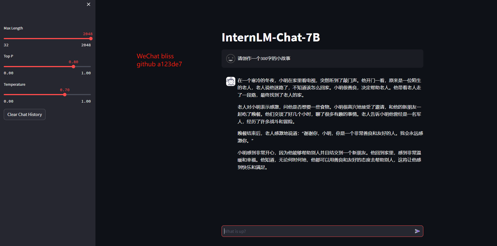
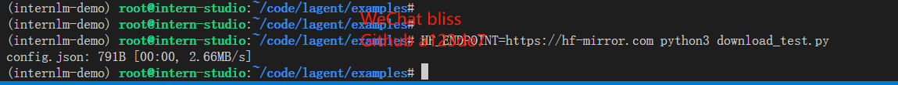
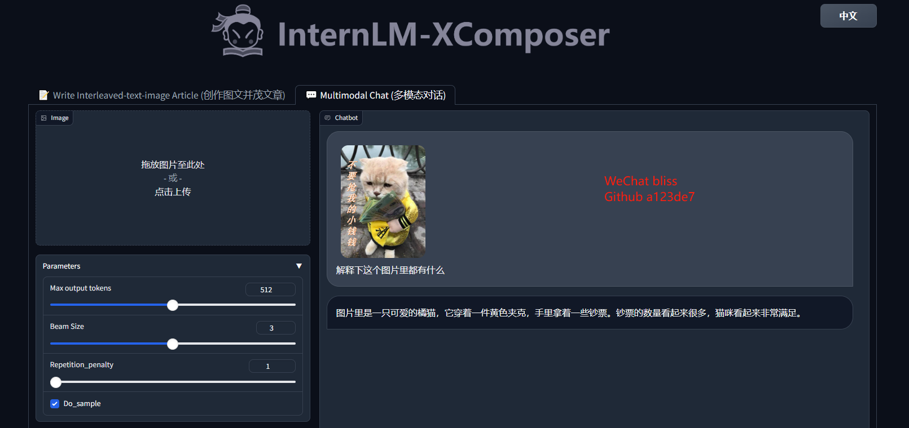
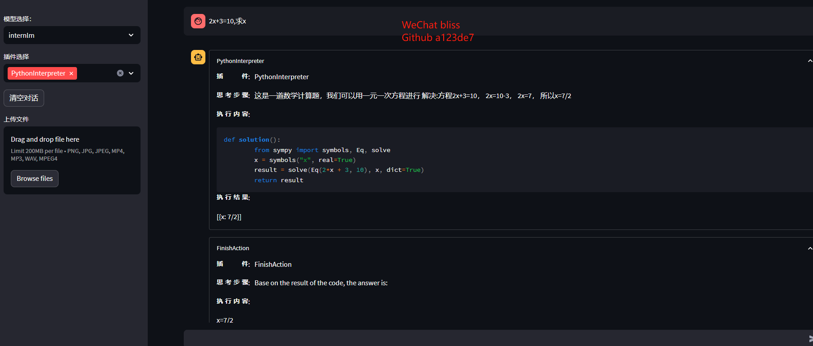

# 2 **轻松玩转书生·浦语大模型趣味Demo-作业**

`基础作业：`

*   `使用 InternLM-Chat-7B 模型生成 300 字的小故事（需截图）。`

    

*   `熟悉 hugging face 下载功能，使用 huggingface_hub python 包，下载 InternLM-20B 的 config.json 文件到本地（需截图下载过程）。`

*   

`进阶作业（可选做）`

*   `完成浦语·灵笔的图文理解及创作部署（需截图）`

    

*   `完成 Lagent 工具调用 Demo 创作部署（需截图）`

    
