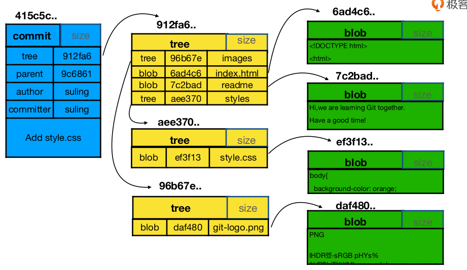
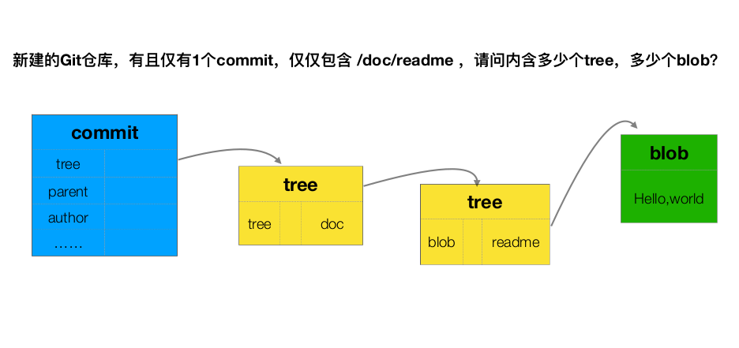
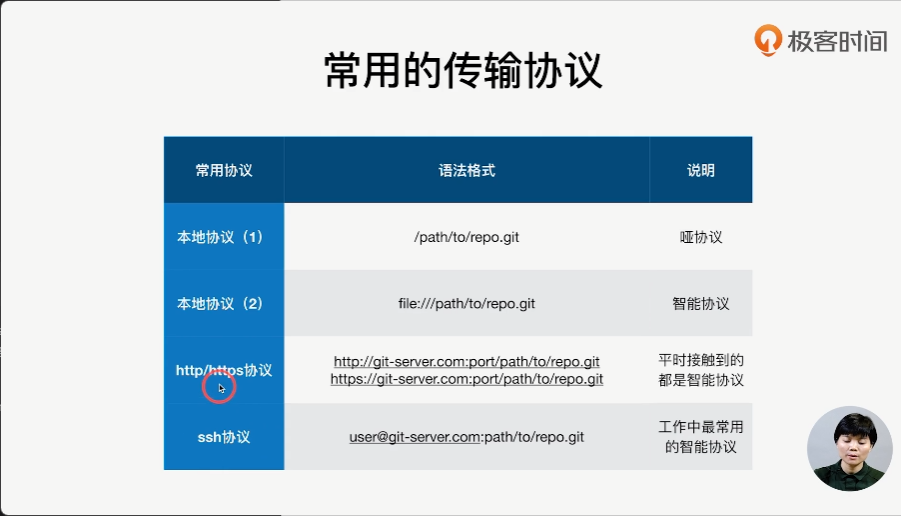

### git 配置
```
git config --global user.name 'your_name'
git config --global user.email 'your_email@domain.com'

git config --local 针对某个仓库
git config --global 当前用户所有仓库
git config --system 系统所有登录用户有效

git config --list --local
```
### 初始化仓库
```
git init learn-git
cd learn-git
git config --local user.name 'test001'
```
### commit
```
git add -u 把已经被git管理的修改过的文件暂存
```
### 重命名文件
```
mv readme readme.md
git rm readme
git add readme.md

git mv readme readme.md
```
### git log
```
git log --online 简洁log
git log -n2 --online 
git branch -v 本地分之
git log --all 所有分之log
git log --graph --all 所有分支图形化界面
git log temp 指定temp分支log
git help --web log 通过web查看文档
```
### .git 目录

```
git cat-file 命令                    显示版本库对象的内容、类型及大小信息。
git cat-file -t b44dd71d62a5a8ed3    显示版本库对象的类型
git cat-file -s b44dd71d62a5a8ed3    显示版本库对象的大小
git cat-file -p b44dd71d62a5a8ed3    显示版本库对象的内容
```
* head  当前所在的ref
  * $ref: refs/heads/master$
* config 配置
    ``` 
    $[core]
        repositoryformatversion = 0
        filemode = true
        bare = false
        logallrefupdates = true
    [user]
        name = bliss
    ```
* refs 引用
  * heads 分支,存的是commit文件
     ```
     commit文件
     cd ./refs/heads
     git cat-file -p 1e72920
    tree 58bf0bf8871de36092e26a47e0fd22ce1521873f
    parent d1fce0ea2ee97ad1f5621ec1911c2b27cadc7410
    author bliss <a123de7@163.com> 1655455839 +0800
    committer bliss <a123de7@163.com> 1655455839 +0800

    rename readme

    tree文件
    git cat-file -p 58bf0bf8871de36092e26a47e0fd22ce1521873f
    040000 tree 96b67e399c8496ec36cbbbcb776eb924fad7f9a7	images
    100644 blob 6ad4c68d567a1a5b415dcfce2010fce1a60b245f	index.html
    040000 tree 87b3e92f70e7dfa555f141afeae28a2bc4a343b6	js
    100644 blob 7c2bad210b150a75f2734035454e60cde30b5c33	readme.md
    040000 tree 442790de7d5619429f756903a17917b7e763c51c	styles

     ```
  * tags 标签 
* objects
  * 文件夹名以hash前2位字符命名
  * hash后38位做文件
  * pack git打包的文件  
### commit vs tree vs blob 个数问题

新建一个/doc/readme文件,提交后,这个commit有一次tree 对应doc目录,tree里存放的另一个tree,对应readme这个blob文件
### 分离头指针
变更没有基于branch,后续checkout 到分支时, 改动后续会被git清除掉 
```
git checkout fix-css baa123, 基于这个commit生成一个分支
```
#### head ^ ~
https://blog.csdn.net/albertsh/article/details/106448035
* git log 树形图
    ```
    *表示一个commit， 注意不要管*在哪一条主线上
    |表示分支前进
    /表示分叉
    \表示合入
    ```
* diff
    ```
    git head ^ = git head ~ 相同
    区别在于后面加数字时
    git head^2 第二个父节点,当没有第二个父节点时,pathspec 'HEAD^2' did not match any file(s) known to git
    git head~2 父节点的父节点 
    一个节点可以有多个父节点(当分支merge时,这两个分支的HEAD都会成为合并后最新提交的父节点,父节点顺序由合并的顺序决定)
    git rev-parse HEAD^2 显示HEAD对应的commit的hash值
    ```    
### 删除分支
```
git branch -d test-branch
git branh -D test-branch
```
### 修改commit
```
git commit  --amend 修补最近一次的commit,比如添加新的文件,修改message等 
git rebase -i --root 第一次提交的commit
git rebase -i parent_commit 
reword 
```
### 合并commit
#### 合并连续的commit
```
git rebase -i <commits-firstest's-parent> 要合并commit集合的最早的commit的父节点
除了最新的commit是pick,其余是squash
pick commit4
squash commit3
squash commit2
squash commit1
pick commit1-parent
```

#### 合并间隔的commit
```
commit2
commit 
commit1

git rebase -i commit1-parent 
pick commit1
s commit2 
pick commit
```
### 比较文件
#### 暂存区 HEAD
```
git add something
git diff --cached
```
#### 工作区 暂存区 diff
```
git diff
git diff -- readme 查看readme的变更
```
#### 不通commit
```
git diff commit1 commit2
git diff commit1 commit2 -- file1
```
### 暂存区恢复到head
```
git reset HEAD 暂存区所有文件 
git reset HEAD -- somefile 暂存区某个文件恢复到head
```
### 工作区恢复到暂存区
```
git checkout -- 文件
```
### 消除最近几次commit
```
git reset --hard HEAD 指向某个commit,暂存区和工作区恢复到这个commit
```
### 删除文件
```
rm readme 工作区删除
git rm readme 暂存区删除


git rm readme 工作区/暂存区删除文件
```
### stash变更
```
git stash 将工作区暂存到stash区
git stash list
git stash pop stash@2
git stash apply
```
### gitignore
https://github.com/github/gitignore  
```
# Prerequisites
*.d

# Object files
*.o
*.ko
*.obj
*.elf

# Linker output
*.ilk
*.map
*.exp

# Precompiled Headers
*.gch
*.pch

# Libraries
*.lib
*.a
*.la
*.lo

# Shared objects (inc. Windows DLLs)
*.dll
*.so
*.so.*
*.dylib

# Executables
*.exe
*.out
*.app
*.i*86
*.x86_64
*.hex

# Debug files
*.dSYM/
*.su
*.idb
*.pdb

# Kernel Module Compile Results
*.mod*
*.cmd
.tmp_versions/
modules.order
Module.symvers
Mkfile.old
dkms.conf

```
文件 .gitignore 的格式规范如下：
* 所有空行或者以 # 开头的行都会被 Git 忽略。
* 可以使用标准的 glob 模式匹配，它会递归地应用在整个工作区中。
* 匹配模式可以以（/）开头防止递归。
* 匹配模式可以以（/）结尾指定目录。
* 要忽略指定模式以外的文件或目录，可以在模式前加上叹号（!）取反

```
# 忽略所有的 .a 文件
*.a

# 但跟踪所有的 lib.a，即便你在前面忽略了 .a 文件
!lib.a

# 只忽略当前目录下的 TODO 文件，而不忽略 subdir/TODO
/TODO

# 忽略任何目录下名为 build 的文件夹
build/

# 忽略 doc/notes.txt，但不忽略 doc/server/arch.txt
doc/*.txt

# 忽略 doc/ 目录及其所有子目录下的 .pdf 文件
doc/**/*.pdf
```
提交commit后，想再忽略一些已经提交的文件
```
把想忽略的文件添加到 .gitignore ；然后通过 git rm  -- cached name_of_file 的方式删除掉git仓库里面无需跟踪的文件。
```
### git仓库备份

```
--bare 不带工作区
git clone --bare file:///path/to/repo/.git localRepoName.git
git clone file:///home/bliss/learn/learn-git/.git learn-git-bak.git

git remote -v 
git remote add zhienng file:///home/bliss/learn/bak/learn-git-zhineng.git
git push --set-upstream zhineng master

```
### 冲突合并
远端有人已经提交了,但是本地没有及时的pull,修改已经提交到本地了,push到远端的时候报错  
* 把远端的fetch下,然后和本地的分支merge下,之后再push
* 本地的commit先撤销下, $git reset HEAD^$, $git \ pull$后再push
### github
#### `github.com/features`
  * collaborative coding
  * automation & ci/cd 
  * security
  * client apps
  * project management
  * team administration
  * community
#### github search
* https://docs.github.com/cn/search-github/getting-started-with-searching-on-github/about-searching-on-github  

|  语法   | example  | 含义 |  
|  ----  | ----  |   ---  |
|  in:readme | 	jquery in:readme |    匹配仓库自述文件中提及 "jquery" 的仓库
| in:name  | jquery in:name | 匹配仓库名称中含有 "jquery" 的仓库 |
| in:description  | jquery in:name,description  | 匹配仓库名称或说明中含有 "jquery" 的仓库 |
| in:topics  | jquery in:topics | 单元格 |
| repo:owner/name  | repo:octocat/hello-world | 匹配特定仓库名称 |
|followers:n|node followers:>=10000|匹配有 10,000 或更多关注者提及文字 "node" 的仓库
||styleguide linter followers:1..10|匹配拥有 1 到 10 个关注者并且提及 "styleguide linter" 一词的的仓库|
|stars:n|	stars:>=500 fork:true language:php | 匹配具有至少 500 个星号，包括复刻的星号（以 PHP 编写）的仓库|
|filename:FILENAME|filename:.vimrc commands|	 匹配含有 "commands" 字样的 .vimrc 文件|
||	filename:test_helper path:test language:ruby|匹配 test 目录内名为 test_helper 的 Ruby 文件|
### github 组织
https://docs.github.com/cn/organizations
#### 角色
* Read: Recommended for non-code contributors who want to view or discuss your project  
* Triage: Recommended for contributors who need to proactively manage issues and pull requests without write access  
* Write: Recommended for contributors who actively push to your project    
* Maintain: Recommended for project managers who need to manage the repository without access to sensitive or destructive actions  
* Admin: Recommended for people who need full access to the project, including sensitive and destructive actions like managing security or deleting a repository  
#### 角色权限
https://docs.github.com/cn/organizations/managing-access-to-your-organizations-repositories/repository-roles-for-an-organization  
#### 分支合并策略
* merge
* squash
* rebase
#### 通过issue跟踪需求和任务
#### 通过project管理issue 
